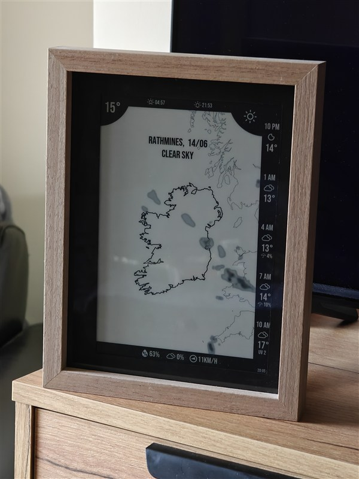

# Raspberry Pi E-Paper Weathermap

Displays a live radar map and weather forecast on a Waveshare 9.7" e-paper screen connected to a Raspberry Pi. Fetches data, draws the map, and pushes it to the display. Updates the display every 10 minutes.

Settings for Ireland only.

<table><tr>
<td></td>
<td></td>
</tr></table>


---

## Display layout

- **Main panel** — country map with near-live radar overlay, pinpointed locations, current conditions and weather warnings.
- **Sidebar** — next 12 hours in 3 hour blocks: temperature, wind, humidity, UV index, and any active weather warnings.

---

## Hardware

- Raspberry Pi 3B+
- Waveshare 9.7" e-paper HAT (IT8951 controller, 1200×825px, SPI)

---

## Data sources

No API key required.

| Source | Data |
|--------|------|
| [Open-Meteo](https://open-meteo.com/) | Hourly and daily forecast |
| [RainViewer](https://www.rainviewer.com/api.html) | Live radar tiles (global) |
| [Met Éireann Open Data](https://data.gov.ie/dataset/met-eireann-open-data-api) | Live polar radar HDF5 (Ireland, switchable alternative to RainViewer) |
| [Met Éireann Open Data](https://www.met.ie/about-us/our-data) | Weather warnings (Ireland) |
| [Natural Earth](https://www.naturalearthdata.com/) | Country boundary shapefiles |

---

## Setup

See [SETUP_GUIDE.md](SETUP_GUIDE.md) for full Raspberry Pi installation instructions.

For a quick test on any machine (no display required):

```bash
cp config.example.py config.py   # edit your location
pip install -r requirements.txt
python run.py --no-display
```
---

## APIs

**[Open-Meteo](https://open-meteo.com/)** — temperature, wind, humidity, UV index, precipitation probability, weather codes, sunrise/sunset.

**[RainViewer](https://www.rainviewer.com/api.html)** — live radar overlay. RainViewer aggregates radar data from national weather services across Europe and serves it as standard map tiles.

**[Met Éireann Open Data](https://www.met.ie/about-us/our-data)** — county-level weather warnings (Status Yellow, Orange, Red). Open-Meteo doesn't provide warnings, only forecasts. Met Éireann publishes a JSON endpoint per county with active warnings. Ireland only.

**Met Éireann polar radar** — an alternative radar source to RainViewer, switchable via `RADAR_SOURCE = "met"` in `config.py`. Instead of pre-rendered map tiles, Met Éireann publishes raw ODIM HDF5 polar volume files every ~5 minutes from two radar stations: Dublin (PAGZ41) and Shannon (PAGZ40). Ireland only.

---

## Libraries

**[IT8951](https://github.com/GregDMeyer/IT8951)** — hardware driver for the Waveshare e-paper display. 

**[Cartopy](https://scitools.org.uk/cartopy/)** — map projection. Needed to place radar tiles in the right position and render shapefiles.

**[Pillow](https://pillow.readthedocs.io/)** — image composition. Cartopy generates the base map as a matplotlib figure; Pillow takes that PNG and composites everything on top — sidebar, icons, text labels, warning overlays — then saves the final BMP that IT8951 sends to the screen.

**[Shapely](https://shapely.readthedocs.io/) / [PyShp](https://github.com/GeospatialPython/pyshp)** — shapefile parsing. The Natural Earth files define country borders as polygon geometry. PyShp reads the `.shp` file format, Shapely converts those records into geometry objects that Cartopy can render.

**[mercantile](https://github.com/mapbox/mercantile)** — tile coordinate utilities. Converts between tile coordinates (x, y, zoom) and geographic bounding boxes, so radar tiles are fetched for the right area and placed correctly on the projection.

---
