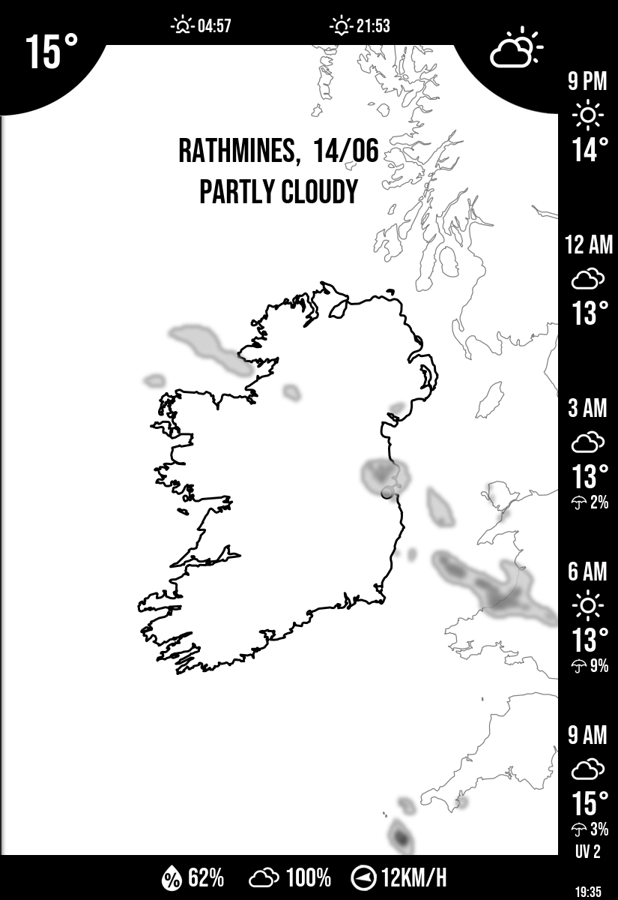

# Raspberry Pi E-Paper Weathermap

Displays a live radar map and weather forecast on a Waveshare 9.7" e-paper screen connected to a Raspberry Pi. Fetches data, draws the map, and pushes it to the display — runs on a cron schedule.




---

## Display layout

- **Main panel** — country map with live radar overlay, labelled locations, and a 3-day forecast strip
- **Sidebar** — current conditions: temperature, wind, humidity, UV index, and any active weather warnings

---

## Hardware

- Raspberry Pi 3B+
- Waveshare 9.7" e-paper HAT (IT8951 controller, 1200×825px, SPI)

---

## Data sources

No API key required.

| Source | Data |
|--------|------|
| [Open-Meteo](https://open-meteo.com/) | Hourly and daily forecast |
| [RainViewer](https://www.rainviewer.com/api.html) | Live radar tiles (global) |
| [Met Éireann Open Data](https://data.gov.ie/dataset/met-eireann-open-data-api) | Live polar radar HDF5 (Ireland, switchable alternative to RainViewer) |
| [Met Éireann Open Data](https://www.met.ie/about-us/our-data) | Weather warnings (Ireland) |
| [Natural Earth](https://www.naturalearthdata.com/) | Country boundary shapefiles |

---

## Setup

See [SETUP_GUIDE.md](SETUP_GUIDE.md) for full Raspberry Pi installation instructions.

For a quick test on any machine (no display required):

```bash
cp config.example.py config.py   # edit your location
pip install -r requirements.txt
python run.py --no-display
```

To run the test suite:

```bash
pip install -r requirements-dev.txt
pytest
```

Tests that require local assets (fonts, icons, shapefiles) or cartopy are automatically skipped if those aren't present.

---

## APIs

**[Open-Meteo](https://open-meteo.com/)** — temperature, wind, humidity, UV index, precipitation probability, weather codes, sunrise/sunset. Free with no registration or API key, works for both Ireland and Germany with the same call.

**[RainViewer](https://www.rainviewer.com/api.html)** — live radar overlay. RainViewer aggregates radar data from national weather services across Europe and serves it as standard map tiles (the same x/y/z scheme as Google Maps), which Cartopy can consume directly.

**[Met Éireann Open Data](https://www.met.ie/about-us/our-data)** — county-level weather warnings (Status Yellow, Orange, Red). Open-Meteo doesn't provide warnings, only forecasts. Met Éireann publishes a JSON endpoint per county with active warnings. Ireland only.

**Met Éireann polar radar** — an alternative radar source to RainViewer, switchable via `RADAR_SOURCE = "met"` in `config.py`. Instead of pre-rendered map tiles, Met Éireann publishes raw ODIM HDF5 polar volume files every ~5 minutes from two radar stations: Dublin (PAGZ41) and Shannon (PAGZ40). Each file contains 360 azimuth rays × 250 range bins of DBZH reflectivity at the lowest elevation angle. The code converts polar coordinates to latitude/longitude using spherical geometry, then maps those to screen pixels using the same Mercator projection as the base map — no Cartopy required at render time. Useful if you want higher update frequency or no dependency on RainViewer's CDN. Ireland only.

---

## Libraries

**[IT8951](https://github.com/GregDMeyer/IT8951)** — hardware driver for the Waveshare e-paper display. The display uses an IT8951 controller chip over SPI. Without this library you'd have to implement the SPI protocol and IT8951 command set manually — sending the image buffer, handling VCOM, managing the refresh cycle. Waveshare also publish their own reference implementation at [waveshare/IT8951](https://github.com/waveshare/IT8951).

**[Cartopy](https://scitools.org.uk/cartopy/)** — map projection. The display is a flat rectangle but the Earth is a sphere — Cartopy converts geographic coordinates to pixel positions in Mercator projection, draws country outlines correctly, and handles the coordinate transforms needed to place radar tiles in the right position.

**[Pillow](https://pillow.readthedocs.io/)** — image composition. Cartopy generates the base map as a matplotlib figure; Pillow takes that PNG and composites everything on top — sidebar, icons, text labels, warning overlays — then saves the final BMP that IT8951 sends to the screen.

**[Shapely](https://shapely.readthedocs.io/) / [PyShp](https://github.com/GeospatialPython/pyshp)** — shapefile parsing. The Natural Earth files define country borders as polygon geometry. PyShp reads the `.shp` file format, Shapely converts those records into geometry objects that Cartopy can render.

**[mercantile](https://github.com/mapbox/mercantile)** — tile coordinate utilities. Converts between tile coordinates (x, y, zoom) and geographic bounding boxes, so radar tiles are fetched for the right area and placed correctly on the projection.

---

## Project structure

```
├── run.py                      # Entry point
├── send_to_display.py          # Sends image to e-paper (Pi only, IT8951)
├── config.example.py           # Config template — copy to config.py
├── config.py                   # Your settings (gitignored, never committed)
├── requirements.txt            # Runtime dependencies
├── requirements-dev.txt        # Adds pytest for running tests
├── weathermap/
│   ├── radar.py                # Map rendering (cartopy, radar tiles)
│   ├── builder.py              # Image composition (forecast strip, warnings, sidebar)
│   └── forecast.py             # Open-Meteo and Met Éireann data fetch
├── tests/
│   ├── conftest.py             # Shared pytest fixtures
│   ├── helpers.py              # Shared test constants and skip markers
│   ├── test_forecast.py        # Integration tests: API calls
│   ├── test_radar.py           # Integration tests: map rendering (requires cartopy)
│   ├── test_builder.py         # Integration tests: image composition (requires assets)
│   └── test_config.py          # Unit tests: config completeness
├── tools/
│   └── transparent_png.py      # Utility: make white pixels transparent in icon PNGs
├── fonts/                      # BebasNeue-Regular.ttf
├── icons-transparent/          # Weather icon PNGs
└── ne_10m_map_units/           # Natural Earth shapefiles (download instructions in SETUP_PI.md)
```
